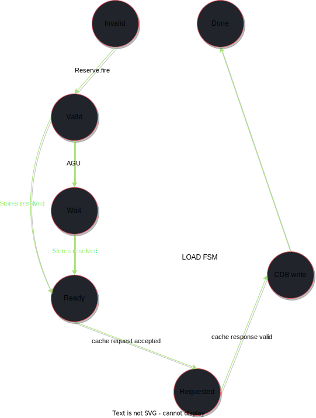
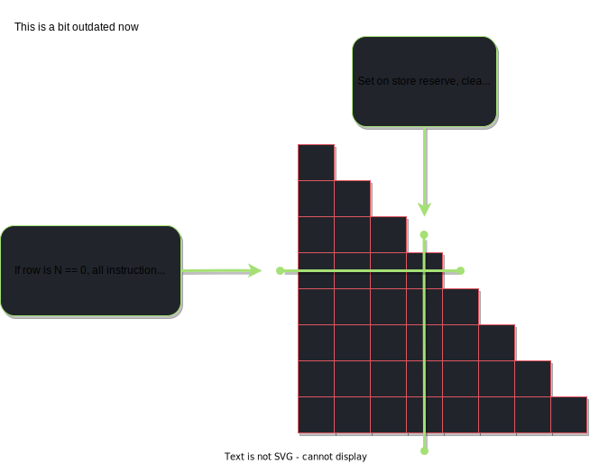

The ChaosCore MOB is a particularly complex module. This is largely due its responsibility in ensuring memory consistency as well as the role it plays in the overall performance of the core. (this sucks).

# Specifications

| Parameter  | Value                              |
|------------|------------------------------------|
| Entries    | 16*                                |
| Fmax       | 150 MHz                            |
| LUTs       | 3970(5.63%) LUTs                   |
| Ordering   | Store Only (Aggressive)            |
| Device     | ZU3EG Series 7 Ultrascale+         |

# High level discription of operation

The MOB's operation consists of two primary functional sub-modules. The first being the MOB itself, consisting of ~16 entries, each containing information pertaining to the memory request itself, as well as a few state bits tracking the progress of each MOB entry in MOB. The second component is the indetermination matrix, which is used to keep track of the disambiguation status of each MOB entry. Since the ChaosCore MOB allows for loads to fire prior to the disambiguation of younger stores, the MOB must be able to indicate to the ROB that a memory violation has occurred. As such, though a load may execute prior to a previous store, when loads mark the "complete" bit in the ROB it is critical that this is not done until it is guaranteed that the corresponding violation bit is also 100% correct. Though load results are broadcast to the CDB in arbitrary order, they do not mark the complete bit in the ROB until all previous addresses are disambiguated. Again, this is to ensure that the corresponding violation bit associated with the load is 100% correct. 

# Operation

As mentioned, the MOB consists of a series of MOB entries, each with their own state bits. As such, the operation of the MOB entry can be split into a series of steps applied to each entry on an individual basis, and a series of steps applied to the MOB as a whole. 

## MOB Entry Functionality

Each MOB entry contains a STATE feild that tracks the progress of that MOB entry. Though the state bits are shared, they differ in functionality greatly between Stores and Loads. In any case, the state machines are attached in figure [1].

### Loads

The operation of loads naturally begins when the MOB receives an allocation request for the memory operation. This reservation request places any useful data about the memory operation in the MOB entry that is available during decode. This moves the state of the MOB entry from `invalid` to `valid`. At some point in the future, the MOB will receive the address of the load from the AGU. Since the memory reservation station (MEMRS) is a fully out of order module, this happens as soon as it can and offers no ordering relative to other loads. When the AGU provides the data for the MOB entry, the state updates from `valid` to `ready` indicating that the memory operation is ready to be fired to the D\$. During this transition, the MOB is searched for older stores to the same address. If found, the data from the store is forwarded to the load. During the ready state, the MOB entry is scheduled for memory access. When granted, the state will update from `ready` to `requested`. When the D\$ responds with the data, the MOB entry will accept this new data and merge it with any possible stores that have forwarded their data (more on this later). The state of the MOB entry is then updated from `Requested` to `CDB write`, indicating that the MOB entry is now free to broadcast its result to the CDB. Once its output is accepted, the state will either transition from `CDB write` to `almost complete` if the violation bit is not yet guaranteed, or from `CDB write` to `complete` if the violation bit has been set. The violation bit validity is determined by the status of the indetermination matrix. This is discussed in more detail in later sections.

  

### Stores

Stores leverage fewer states than loads. This is partly because stores are not executed until committed by the ROB. Nonetheless, store MOB entries start off in a very similar fashion to load MOB entries. 

Store MOB entries are initialized to valid when they receive an allocation request, updating the state from `invalid` to `valid`. When the AGU provides the MOB entry with the Store data and address, the MOB entry state will update from `valid` to `complete`. During this transition, the store will also look up the entire MOB for younger loads to the same address. If found, that entry is marked to be in violation of memory ordering. Additionally, the MOB will notify the ROB about the "completion" of the store instruction. At this point, the store MOB entry will wait for the ROB to commit the instruction. When (if) this occurs, the state of the MOB entry will update from `complete` to `committed`. At this point, the MOB entry will remain in this state until it is scheduled to be written to the D$. When written to memory, the entry is cleared. 

  

## MOB Functionality

MOB entries are able to update their state based on their selection for D$ access, CDB access, and violation validation, etc... This leaves the important task of scheduling and arbitrating to external parts of the MOB. 

First, the MOB is responsible for the searches on received loads and stores. 

Second, the MOB must arbitrate D$ access between committed stores and ready loads. For the purposes of this MOB, priority is given to ready loads. Committed stores are scheduled only if there are no ready loads in the MOB. This is acceptable because store data can just be forwarded. This is acceptable because loads will either look up the MOB for earlier stores to the same address, or the store will be scheduled and cleared, in which case the load will reflect the data of the earlier scheduled load. 

The MOB is also responsible for performing stores when they are at the front of the MOB and have committed. 

### Indetermination Matrix

  

# FAQs

1)  Why the indetermination matrix?
    - Consider the fetch packet [NOP] [NOP] [Store] [LOAD]. The load is marked complete only when its violation bit is guaranteed, which does not occur untill all previous stores have executed. Since ChaosCore's ROB only commits entire fetch packets at a time, the fetch packet the LOAD resides in cannot commit until the LOAD itself commits. Attempting to check if the oldest previous store has committed will pretty quickly result in deadlock. An indetermination matrix provides a clean way to validate if all previous instructions, committed or uncommitted, have had their addresses resolved. If this is the case, the load can mark its ROB entry as completed regardless of any previous store commit status. 

# References